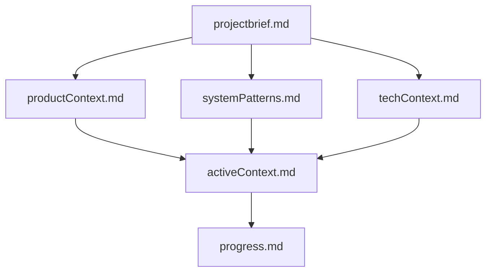

# 🧠 Memory Bank Template

A comprehensive template for creating and maintaining AI assistant memory systems, compatible with both GitHub Copilot and Cursor AI. This system solves the context retention problem between AI assistant sessions by providing a structured documentation approach.



## 🎯 Purpose

The Memory Bank system provides AI assistants with persistent context between sessions. It uses a structured set of documentation files that AI assistants can access to maintain context about your project's:

- Requirements and goals
- Technical architecture
- Current progress
- Development patterns and rules
- And more

This allows for more consistent and effective AI assistance across multiple sessions and different AI tools.

## Branch Structure

This repository contains multiple branches for different use cases:

### `boilerplates` Branch

- Contains only the Memory Bank template files
- Ideal for users who want to implement the Memory Bank pattern in their existing projects
- No additional code or frameworks included

### `develop` Branch

- Contains a Django REST Framework implementation with the Memory Bank pattern
- Includes authentication, API endpoints, and a working example
- Perfect for users who want to see a working implementation or start a new DRF project with Memory Bank integration

Choose the branch that best fits your needs:

```bash
# For just the Memory Bank template
git checkout boilerplates

# For the full DRF implementation with Memory Bank
git checkout develop
```

## 🚀 Getting Started

### 1. Clone this repository

```bash
git clone https://github.com/banhmysuawx/memory-bank-template.git
cd memory-bank-template
```

### 2. Set Up Your Project Structure

Ensure your project has the following structure:

```
your-project/
├── memory-bank/          # Core memory files
│   ├── projectbrief.md    
│   ├── productContext.md  
│   ├── activeContext.md   
│   ├── systemPatterns.md  
│   ├── techContext.md     
│   ├── progress.md       
│   └── notes/            # Optional additional context
│       └── ...
├── .cursor/rules/        # For Cursor AI
│   ├── memory-bank.mdc   
│   └── core.mdc         
└── .github/              # For GitHub Copilot
    ├── memory-bank.md    
    └── copilot-instructions.md
```

### 3. Fill Out Core Memory Files

Start by filling out these key files:

1. `projectbrief.md` - Define your project's requirements and goals
2. `productContext.md` - Describe the problems your project solves
3. `techContext.md` - List technologies, dependencies, and setup requirements

## 🏗️ Memory Bank Structure

### Core Files

1. **projectbrief.md**
   - Foundation document that shapes all other files
   - Defines core requirements and goals
   - Source of truth for project scope

2. **productContext.md**
   - Why this project exists
   - Problems it solves
   - How it should work
   - User experience goals

3. **activeContext.md**
   - Current work focus
   - Recent changes
   - Next steps
   - Active decisions and considerations

4. **systemPatterns.md**
   - System architecture
   - Key technical decisions
   - Design patterns in use
   - Component relationships

5. **techContext.md**
   - Technologies used
   - Development setup
   - Technical constraints
   - Dependencies

6. **progress.md**
   - What works
   - What's left to build
   - Current status
   - Known issues

### Additional Context Files

Create additional files/folders within `memory-bank/` as needed:

- `api.md` - API documentation
- `deployment.md` - Deployment procedures
- `testing.md` - Testing strategies
- `rules.md` - Development guidelines
- `notes/` - Additional context (feature-specific documentation, etc.)

## 🤖 Using with AI Assistants

### GitHub Copilot

1. Set up the `.github/` directory with the provided files
2. When working with Copilot Chat, you can reference the Memory Bank files:

   ```text
   I'd like you to read my memory-bank files to understand the project context.
   ```

3. Update the Memory Bank:

   ```text
   update memory bank
   ```

### Cursor AI

1. Set up the `.cursor/rules/` directory with the provided files
2. Cursor will automatically read the memory bank files at the start of each task
3. Update the Memory Bank:

   ```text
   update memory bank
   ```

## 📝 Working with Plan and Act Modes

Both Cursor and GitHub Copilot (when properly configured) support Plan and Act modes:

### Plan Mode

In Plan mode, the AI assistant:

- Works with you to define a plan
- Gathers necessary information
- Does not make any changes

Commands:

```text
PLAN
```

### ⚙️ Act Mode

In Act mode, the AI assistant:

- Makes changes to the codebase based on the approved plan
- Updates documentation as needed

Commands:

```text
ACT
```

## ✅ Best Practices

1. **Keep Memory Files Updated**
   - Regularly update `activeContext.md` and `progress.md`
   - Document new patterns as they emerge

2. **Be Specific in Documentation**
   - Include specific examples of patterns
   - Document preferences and approaches

3. **Use Clear Structure**
   - Use headings, lists, and sections to organize information
   - Keep related information together

4. **Document Technical Decisions**
   - Explain why certain approaches were chosen
   - Document alternatives that were considered

5. **Update After Significant Changes**
   - Keep the Memory Bank synchronized with your code
   - Document new learnings as they occur

## Example Memory Bank Entry

Here's an example `activeContext.md` entry:

```markdown
# Active Context

## Current Focus
- Implementing user authentication system
- Setting up API endpoints for user profiles
- Fixing pagination bug in the search results

## Recent Changes
- Added JWT authentication (completed May 2)
- Refactored database models for better performance

## Next Steps
- Create admin dashboard
- Implement email verification flow

## Active Decisions
- Using FastAPI for all new API endpoints
- Moving to TypeScript for frontend code
- Standardizing on PostgreSQL for all database needs

## Important Patterns
- All API endpoints must follow RESTful conventions
- Authentication uses JWT tokens with 24h expiration
- Frontend uses React Query for API state management
```

## Django Rest Framework (DRF) Implementation via Memory Bank

This project leverages Django Rest Framework for building robust, secure APIs. Below are key details about our DRF implementation.

### DRF Overview

Our API is built with Django Rest Framework, providing:

- **RESTful API endpoints** - Following consistent REST conventions
- **JWT Authentication** - Secure token-based authentication
- **Serialization** - Converting complex data types to Python primitives and back
- **Viewsets & Routers** - Simplifying CRUD operations
- **Permissions** - Granular access control
- **Content negotiation** - Supporting multiple formats (JSON, etc.)

### Authentication

Authentication is implemented using JWT (JSON Web Tokens):

```curl
POST /api/token/ - Obtain JWT token with username & password
POST /api/token/refresh/ - Refresh an existing token
POST /api/token/verify/ - Verify token validity
```

Example authentication flow:

```python
# Request a token
response = requests.post(
    'http://localhost:8000/api/token/',
    data={'email': 'user@example.com', 'password': 'password123'}
)
token = response.json()['access']

# Make an authenticated request
response = requests.get(
    'http://localhost:8000/api/some-protected-endpoint/',
    headers={'Authorization': f'Bearer {token}'}
)
```

### API Endpoints Reference

#### Auth Endpoints

- `POST /api/token/` - Obtain JWT token
- `POST /api/token/refresh/` - Refresh token
- `POST /api/token/verify/` - Verify token validity

#### Account Endpoints

- `GET /api/accounts/profile/` - Get current user profile
- `PUT /api/accounts/profile/` - Update user profile
- `POST /api/accounts/register/` - Register new user

#### Prompt Endpoints

- `GET /api/prompts/` - List prompts
- `POST /api/prompts/` - Create new prompt
- `GET /api/prompts/{id}/` - Retrieve specific prompt
- `PUT /api/prompts/{id}/` - Update prompt
- `DELETE /api/prompts/{id}/` - Delete prompt

### DRF Configuration

Key DRF settings in this project:

```python
# Pagination settings
REST_FRAMEWORK = {
    'DEFAULT_PAGINATION_CLASS': 'rest_framework.pagination.PageNumberPagination',
    'PAGE_SIZE': 10,
    
    'DEFAULT_AUTHENTICATION_CLASSES': (
        'rest_framework_simplejwt.authentication.JWTAuthentication',
    ),
    
    'DEFAULT_SCHEMA_CLASS': 'drf_spectacular.openapi.AutoSchema',
}
```

### Development Guidelines for API

When extending or modifying the API, follow these guidelines:

1. **Viewsets** - Use ViewSets for CRUD operations when appropriate
2. **Serializers** - Create proper serializers with validation
3. **Permissions** - Always set appropriate permission classes
4. **Documentation** - Add docstrings for Swagger/OpenAPI documentation
5. **Testing** - Write tests for all endpoints

Example viewset pattern:

```python
class PromptViewSet(viewsets.ModelViewSet):
    """
    API endpoint for managing prompts.
    """
    queryset = Prompt.objects.all()
    serializer_class = PromptSerializer
    permission_classes = [permissions.IsAuthenticated]
    
    def get_queryset(self):
        """Filter queryset to only return user's prompts."""
        return self.queryset.filter(user=self.request.user)
```

### Testing API Endpoints

API endpoints should be thoroughly tested using Django's test framework:

```python
from rest_framework.test import APITestCase
from rest_framework import status

class PromptAPITests(APITestCase):
    def setUp(self):
        # Create test user and authenticate
        self.user = User.objects.create_user(
            'testuser', 'test@example.com', 'password123'
        )
        self.client.force_authenticate(user=self.user)
        
    def test_create_prompt(self):
        """Test creating a prompt via API."""
        data = {'title': 'Test Prompt', 'content': 'This is a test'}
        response = self.client.post('/api/prompts/', data, format='json')
        self.assertEqual(response.status_code, status.HTTP_201_CREATED)
```

Run API tests with:

```bash
python manage.py test prompts.tests
```

### Security Considerations

1. **Authentication** - Always require authentication for sensitive endpoints
2. **Input Validation** - Validate all input using serializers
3. **Rate Limiting** - Apply rate limiting to prevent abuse
4. **CORS** - Configure proper CORS settings for production
5. **Content Security Policy** - Implement CSP headers

For more details on API implementation, refer to the `api.md` file in the Memory Bank.

## License

[MIT License](LICENSE)
