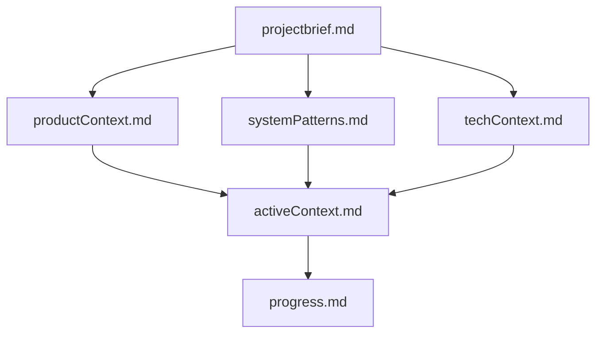

# 🧠 Memory Bank Template

A comprehensive template for creating and maintaining AI assistant memory systems, compatible with both GitHub Copilot and Cursor AI. This system solves the context retention problem between AI assistant sessions by providing a structured documentation approach.



## 🎯 Purpose

The Memory Bank system provides AI assistants with persistent context between sessions. It uses a structured set of documentation files that AI assistants can access to maintain context about your project's:

- Requirements and goals
- Technical architecture
- Current progress
- Development patterns and rules
- And more

This allows for more consistent and effective AI assistance across multiple sessions and different AI tools.

## 🚀 Getting Started

### 1. Clone this repository

```bash
git clone https://github.com/banhmysuawx/memory-bank-template.git
cd memory-bank-template
```

### 2. Set Up Your Project Structure

Ensure your project has the following structure:

```
your-project/
├── memory-bank/          # Core memory files
│   ├── projectbrief.md    
│   ├── productContext.md  
│   ├── activeContext.md   
│   ├── systemPatterns.md  
│   ├── techContext.md     
│   ├── progress.md       
│   └── notes/            # Optional additional context
│       └── ...
├── .cursor/rules/        # For Cursor AI
│   ├── memory-bank.mdc   
│   └── core.mdc         
└── .github/              # For GitHub Copilot
    ├── memory-bank.md    
    └── copilot-instructions.md
```

### 3. Fill Out Core Memory Files

Start by filling out these key files:

1. `projectbrief.md` - Define your project's requirements and goals
2. `productContext.md` - Describe the problems your project solves
3. `techContext.md` - List technologies, dependencies, and setup requirements

## 🏗️ Memory Bank Structure

### Core Files

1. **projectbrief.md**
   - Foundation document that shapes all other files
   - Defines core requirements and goals
   - Source of truth for project scope

2. **productContext.md**
   - Why this project exists
   - Problems it solves
   - How it should work
   - User experience goals

3. **activeContext.md**
   - Current work focus
   - Recent changes
   - Next steps
   - Active decisions and considerations

4. **systemPatterns.md**
   - System architecture
   - Key technical decisions
   - Design patterns in use
   - Component relationships

5. **techContext.md**
   - Technologies used
   - Development setup
   - Technical constraints
   - Dependencies

6. **progress.md**
   - What works
   - What's left to build
   - Current status
   - Known issues

### Additional Context Files

Create additional files/folders within `memory-bank/` as needed:

- `api.md` - API documentation
- `deployment.md` - Deployment procedures
- `testing.md` - Testing strategies
- `rules.md` - Development guidelines
- `notes/` - Additional context (feature-specific documentation, etc.)

## 🤖 Using with AI Assistants

### GitHub Copilot

1. Set up the `.github/` directory with the provided files
2. When working with Copilot Chat, you can reference the Memory Bank files:

   ```text
   I'd like you to read my memory-bank files to understand the project context.
   ```

3. Update the Memory Bank:

   ```text
   update memory bank
   ```

### Cursor AI

1. Set up the `.cursor/rules/` directory with the provided files
2. Cursor will automatically read the memory bank files at the start of each task
3. Update the Memory Bank:

   ```text
   update memory bank
   ```

## 📝 Working with Plan and Act Modes

Both Cursor and GitHub Copilot (when properly configured) support Plan and Act modes:

### Plan Mode

In Plan mode, the AI assistant:

- Works with you to define a plan
- Gathers necessary information
- Does not make any changes

Commands:

```text
PLAN
```

### ⚙️ Act Mode

In Act mode, the AI assistant:

- Makes changes to the codebase based on the approved plan
- Updates documentation as needed

Commands:

```text
ACT
```

## ✅ Best Practices

1. **Keep Memory Files Updated**
   - Regularly update `activeContext.md` and `progress.md`
   - Document new patterns as they emerge

2. **Be Specific in Documentation**
   - Include specific examples of patterns
   - Document preferences and approaches

3. **Use Clear Structure**
   - Use headings, lists, and sections to organize information
   - Keep related information together

4. **Document Technical Decisions**
   - Explain why certain approaches were chosen
   - Document alternatives that were considered

5. **Update After Significant Changes**
   - Keep the Memory Bank synchronized with your code
   - Document new learnings as they occur

## Example Memory Bank Entry

Here's an example `activeContext.md` entry:

```markdown
# Active Context

## Current Focus
- Implementing user authentication system
- Setting up API endpoints for user profiles
- Fixing pagination bug in the search results

## Recent Changes
- Added JWT authentication (completed May 2)
- Refactored database models for better performance

## Next Steps
- Create admin dashboard
- Implement email verification flow

## Active Decisions
- Using FastAPI for all new API endpoints
- Moving to TypeScript for frontend code
- Standardizing on PostgreSQL for all database needs

## Important Patterns
- All API endpoints must follow RESTful conventions
- Authentication uses JWT tokens with 24h expiration
- Frontend uses React Query for API state management
```

## License

[MIT License](LICENSE)
